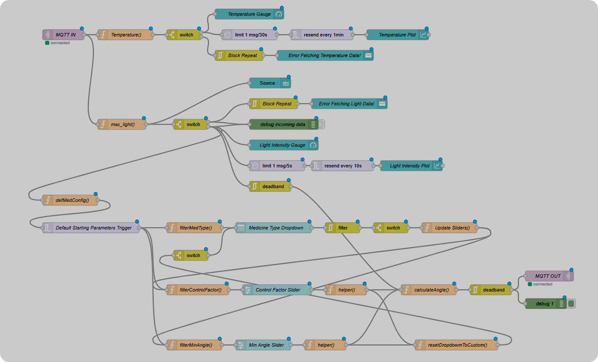
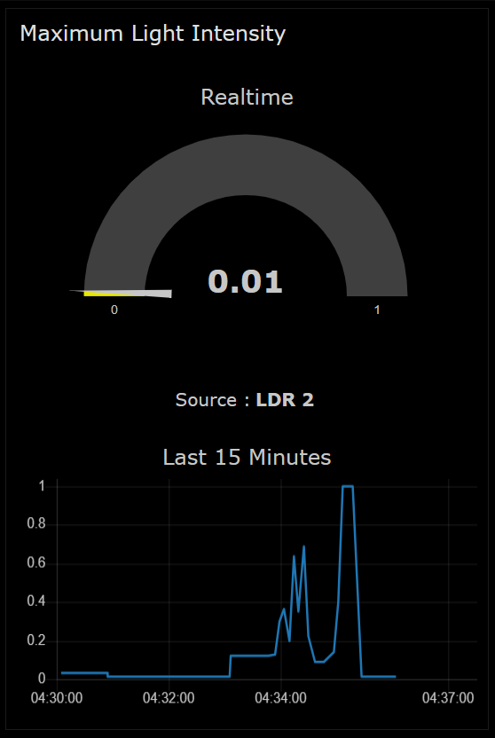
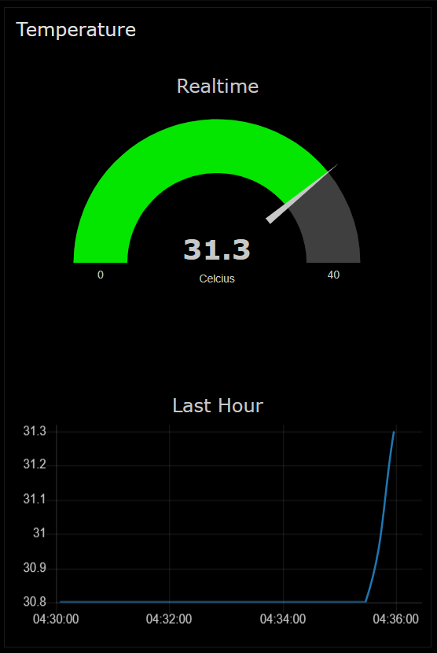

# Smart Medibox

Smart medibox is a smart device that,
1. Remind the user to take medicine at time through alarms.
2. Help to keep medicine in the required conditions via monitoring temperature and humidity continously and notifying the user if there is a bad condition.
3. Controlling the light entering the Medibox through a motorized curtain.

# Technologies and Components

*   This project is developed to use
    *   ADAFRUIT SSD 1306 OLED Monochrome Display (128x64)
    *   ESP32 Devkit V1
    *   DHT11 Temperature and Humidity Sensor. (Easily configurable for DHT22 aswell.)
	*	SG90 Micro Server Motor
	*	LDRs and 10kΩ Resistors 

	out of the box.

If the components change, you may have to change some parameters accordingly. 
<br><br>

<div align="center">
	<code></code>
	<code></code>
	<code></code>
	<code></code>
	<code></code>
	<code></code>
</div>

## platform.ini

```ini
[env:esp32doit-devkit-v1]
platform = espressif32
board = esp32doit-devkit-v1
framework = arduino
lib_deps = 
	adafruit/Adafruit GFX Library@^1.11.9
	adafruit/Adafruit SSD1306@^2.5.9
	adafruit/DHT sensor library@^1.4.6
	roboticsbrno/ServoESP32@1.0.3
	knolleary/PubSubClient@^2.8
	bblanchon/ArduinoJson@^7.0.4
```


*   This was developed using Platform IO with Arduino Framework. (You can use the code in branch [`Wokwi`](https://github.com/chathura-de-silva/Smart-Medibox/tree/Wokwi), if you are looking forward for a simulation. But note that it lack some newly added features including Node-Red connectivity.)

# Getting Started

## Prerequisites
*   Git
*   Platform I/O with Arduino Framework Set up.
*   Relevant hardware for testing if you are not intended to do simulations.
*	Node-Red Installed Environment and an MQTT Broker (Both optional)


## Medibox Setup
*   Clone the repository.
    ```bash 
    git clone https://github.com/chathura-de-silva/Smart-Medibox     
    ```

 >[!IMPORTANT]<br>
> If you are willing to simulate the project using Wokwi extension, then clone the relavant branch using this, instead. (Or you can switch branches later.)
>    ```bash 
>     git clone -b Wokwi https://github.com/chathura-de-silva/Smart-Medibox     
>  ```


* Typically platform I/O will install required libraries itself. If not you have to install them referring the [`platform.ini`](#platform.ini)
 file displayed above.

* Compile and Upload/Simulate.

## Node-Red Dashboard

*	After completing the above step, all the basic and the major functionalities of will work except for the Node-Red based functionalities. Use following instructions for successfully deploy an instance of the Node-Red Dashboard.

*	Import the `./Nodered Flows/flows.json` to the Node-Red canvas.
*	Setup required parameters of the flows including the MQTT server and then deploy. (This is defaulted to the Mosquito testing server.)

# Configuration and Structure

## Codebase
* Three seperate header files inside `./include` directory :
	*	`Constants.h` : Contains all constants.
	*	`Functions.h` : Contains declarations of all global functions.
	*	`Globals.h` : Contains declarations of all the global constants.
*	The initialisation and definitions of variables and functions are done in the relavant `.cpp` files.

*	`main.cpp` contains the arduino *loop()* and *setup()* functions.

* The device code is developed in such a way that it's actively listening(polling) for user inputs and for collecting sensor data from the DHT sensor. 
*	For an instance the three function calls in loop() function is responsible for,
	1.	`update_time_with_check_alarm()` - Updates the the time on the display. Checks whether there are any alarms to be rung at the moment. Calls `ring_alarm()` inside it if there is any.

	2.	`go_to_menu()` - Activelly listening for button presses and then keeps track of the selected mode by user via an abstract variable. When user confirms a menu item via pressing OK button, the `run_mode(mode)` is called. `run_mode(mode)` handles the rest via somr another nested function calls.

	3.	`check_temp()` - Reads the data from the `DHT11` sensor, prints a warning in the display if there is any parameter that is out of the specified limits. If there isn't any, plays an animation on the screen indicating it is actively monitoring those parameters.

## Configuration of Wireless Accesspoint and WiFi Credentials

### Hardcoded values
*	You can change the default values for both the passwords and SSIDs of the Wireless Accesspoint created by the Smart Medibox as well as the default SSID and Password for your wireless internet access point. 
* To do so, change the `./include/constants.h` accordingly. 
* Existing default values are as follows.
```cpp
...
//SSID and Password of the Access point created by the Medibox.
#define AP_SSID "Smart Medibox" 
#define AP_PASSWORD "abcdefgh"
...
//SSID and Password of your internet accesspoint. 
//It is not necessary to change this here. 
//You can change the effective values of these parameters anytime,
//Even after uploading the binary to the device.
#define DEFAULT_WIFI_SSID "MSI 8690" uploading.
#define DEFAULT_WIFI_PASSWORD "abcdefgh"
```

## Configuring your Internet Accesspoint credentials
*	After the initial boot, the device tries to connect to the wireless network with the credentials mentioned above in the `constants.h`. If it is not the first boot, then it will read the credentials from the non-volatile memory of the device. 

*	If the device cannot find the Wifi network with the specified credentials within 10 seconds(You can change this waiting time in the `constants.h`), it will enter the `Wifi configuration Mode` where the device initiates a Wifi Accesspoint (a "Wireless Hotspot") which you can connect to using a device such as a smartphone or a pc.

The default credentials are as follows :
```
SSID : Smart Medibox
Password : abcdefgh
```

*	The display will start displaying an IP address to you to visit to. Open the web browser and visit the IP address specified in the Device Display.(Usually this value is `192.168.4.1`)


*	Enter your Router/Internet Accesspoint SSID and Password and hit `Save`. The device will reboot connecting to the wireless network you specified.

*	While device is up and running, at any time you can change your accesspoint via the main menu of the device. Choose `Wifi Config Menu`.

## Node-Red Dashboard Flow



*	`defmedConfig()` node includes the default parameters for preset light control parameters. In it's "On Start" tab, you can adjust them accordingly.
*	`Default Starting Parameters Trigger` includes Default values for above parameters on startup. 

*	Medibox sends Temperature and Light Data to the Dashboard through broker and this MQTT requests are generated only when those parameters get a considerable change in their value.

*	On the otherhand, the Dashboard sends the required motor angle to the Medibox. This is also done only when there is a considerable change pending.

*	Sensivity of gauges, Plots, and even the change in parameters needed for triggering MQTT Requests can be configured easily.
	```cpp
		#define EPSILON 0.03
		#define TEMPSILON 0.01
	```
	*	`EPSILON` and `TEMPSILON` is the minimum difference needed in previous and current values of the readings of two LDRs and of the Temparature Sensor respectively to Medibox to generate and send an MQTT Request. 

## ESP32 Default Pin Map

| Pin | Constant |  Device |
|---|---|---|
|  5 | BUZZER |Buzzer that rings on Alarms |
|  15 | LED_1 | LED which lights up on Alarms |
|  34 | PB_CANCEL | Push button input which used for cancellations and to go back |
|  25 | PB_OK | Push button input which is used for confirmations and entering the menu|
|  26 | PB_UP |  Push Button input which is used to go up in menu |
|  35 | PB_DOWN |  Push Button input which is used to go down in menu|
|  4 | DHT_PIN |  DHT11 Temperature & Humidity Sensor input|
|  36, 39 | LDR_1, LDR_2 | Input pins of the two LDRs.|
| 33 | SERVO | PWM Output for the Servo motor |

*	These are defined in the same `constants.h` file mentioned above.
# Calculations

## Calculating the Light Intensity

*	Two ways of calculating light intensity is available.
	*	Linear Mapping
	*	Non-Linear Mapping (High Accuracy - Default)

 >[!NOTE]<br>
> Calculating the Light Intensity from a LDR input more accurately needs to be done per LDR basis and uses curve fitting to approximate unique function that approximates the variation of voltage of LDR. Despite being less accurate we can assume that the Non-Linear mapping will mostly be accurate enough for this application.


You may configure following values in `./include/constants.h`. Defaults values are as follows.
```cpp
#define LINEAR_MAPPING 0
#define FINITE_INFINITY 10000
```
*	If you want to use the linear mapping, set `LINEAR_MAPPING` to 1. Otherwise set it to 0.
*	Since the values are capped (Values are finalized between 0 and 1 for easy interpretability.)to a range within 0 and 1 and the luminance can be infinitely large, 

	*	a finite number is specified as infinity(`FINITE_INFINITY`) so that all numbers above that are considered as 1. 
	*	**If you are using linear mapping, the maximum value recommended for FINITE_INFINITY is 4096.0** and otherwise it is 10000 by default, but will have to change according to the LDR used.
	*	Anything above that makes readings shrinked to a narrow range.

*	Since project uses two 5mm LDRs for this purpose, it is not straight forward to calculate the light insentity from the sensor reading(Analog voltage). If there is no need for higher precision, the linear mapping is the way to go. The Non-Linear mapping involves configuration of some more parameters in `./include/constants.h`.

	```cpp
	#define GAMMA 0.7
	#define RL10 50
	#define RESISTOR 10000
	#define VCC 3.3
	```
	*	`GAMMA` - Gamma Value of the LDRs being used.
	*	`RL10` - RL10 value of the LDRs being used.
	*	`RESISTOR` - Resistance of the used Resistors in series with LDRs.
	*	`VCC` - Input Voltage of the Resistor-LDR Series circuit.

## Calculating the Motor Angle

$$θ = \min\{\theta_{\text{offset}} \cdot D + (180 - \theta_{\text{offset}}) \cdot I \cdot \gamma, 180\}$$

| Symbol | Description |
|---|---|
| $$θ$$ | Represents the output angle. Motor rotates to this position. |
| $$\theta_{\text{offset}}$$| Represents the minimum angle that the morot will be in. This is a constant value that influences the output angle. |
| $$D$$ | Coificient of effect of LDR which changes the angle of rotation according the fact that which LDR records higher reading. |
| $$I$$ |Maximum light intensity of the two LDRs. |
| $$\gamma$$ | Controlling factor. This value scales the influence of variable "I" on the output angle. |


# Known issues

A Minor shortcoming : If you accidently entered the wifi configuration menu via the device menu and you don't want to change the current Wifi credentials.
*	 You have to either hard restart the device or refill with the same credentials and click `save` (To do this you have to connect to the Smart Medibox's Wifi Accesspoint and visit the relavant URL using your web browser.)

# Screenshot Gallery

## Device Display
 |   |
:-------------------------:|:-------------------------:|:-------------------------:
  |  |
  |  |

## Node-Red Dashboard

 |  
:-------------------------:|:-------------------------:

# About

This project was first developed as the Semester 4 Project in the Module `EN2853 - Embedded Systems & Applications`, UoM, CSE.

[go to the top](#Smart-Medibox)