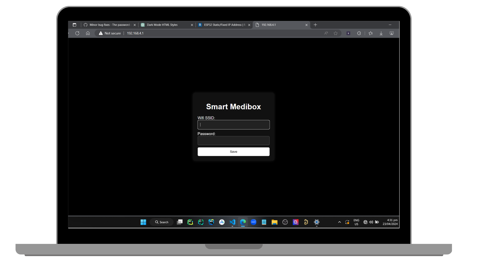

# Smart Medibox

Smart medibox is a smart device that,
1. Remind the user to take medicine at time through alarms.
2. Help to keep medicine in the required conditions via monitoring temperature and humidity continously and notifying the user if there is a bad condition.

# Technologies and Components

*   This project is developed to use
    *   ADAFRUIT SSD 1306 OLED Monochrome Display (128x64)
    *   ESP32 Devkit V1
    *   DHT11 Temperature and Humidity Sensor. (Easily configurable for DHT22 aswell.)

out of the box.
If the components change, you may have to change the parameters accordingly. 
<br><br>

<div align="center">
	<code></code>
	<code></code>
	<code></code>
	<code></code>
	<code></code>
</div>

## platform.ini

```ini
[env:esp32doit-devkit-v1]
platform = espressif32
board = esp32doit-devkit-v1
framework = arduino
lib_deps = 
	adafruit/Adafruit GFX Library@^1.11.9
	adafruit/Adafruit SSD1306@^2.5.9
	adafruit/DHT sensor library@^1.4.6
```


*   This was developed using Platform IO with Arduino Framework. (You can use the code in branch [`Wokwi`](https://github.com/chathura-de-silva/Smart-Medibox/tree/Wokwi), if you are looking forward for a simulation.)

# Getting Started

## Prerequisites
*   Git
*   Platform I/O with Arduino Framework Set up.
*   Relavant hardware for testing if you are not intended to do simulations.
<br>
<br>

*   Clone the repository.
    ```bash 
    git clone https://github.com/chathura-de-silva/Smart-Medibox     
    ```

 >[!IMPORTANT]<br>
> If you are willing to simulate the project using Wokwi extension, then clone the relavant branch using this, instead. (Or you can switch branches later.)
>    ```bash 
>     git clone -b Wokwi https://github.com/chathura-de-silva/Smart-Medibox     
>  ```


* Typically platform I/O will install required libraries itself. If not you have to install them referring the [`platform.ini`](#platform.ini)
 file displayed above.

* Compile and Upload/Simulate.
## Configuration and Structure

* Three seperate header files inside `./include` directory :
	*	`Constants.h` : Contains all constants.
	*	`Functions.h` : Contains declarations of all global functions.
	*	`Globals.h` : Contains declarations of all the global constants.
*	The initialisation and definitions of variables and functions are done in the relavant `.cpp` files.

*	`main.cpp` contains the arduino *loop()* and *setup()* functions.

* The device code is developed in such a way that it's actively listening(polling) for user inputs and for collecting sensor data from the DHT sensor. 
*	For an instance the three function calls in loop() function is responsible for,
	1.	`update_time_with_check_alarm()` - Updates the the time on the display. Checks whether there are any alarms to be rung at the moment. Calls `ring_alarm()` inside it if there is any.

	2.	`go_to_menu()` - Activelly listening for button presses and then keeps track of the selected mode by user via an abstract variable. When user confirms a menu item via pressing OK button, the `run_mode(mode)` is called. `run_mode(mode)` handles the rest via somr another nested function calls.

	3.	`check_temp()` - Reads the data from the `DHT11` sensor, prints a warning in the display if there is any parameter that is out of the specified limits. If there isn't any, plays an animation on the screen indicating it is actively monitoring those parameters.

# Configuration of Wireless Accesspoint and WiFi Credentials

## Hardcoded values
*	You can change the default values for both the passwords and SSIDs of the Wireless Accesspoint created by the Smart Medibox as well as the default SSID and Password for your wireless internet access point. 
* To do so, change the `./include/constants.h` accordingly. 
* Existing default values are as follows.
```cpp
...
//SSID and Password of the Access point created by the Medibox.
#define AP_SSID "Smart Medibox" 
#define AP_PASSWORD "abcdefgh"
...
//SSID and Password of your internet accesspoint. 
//It is not necessary to change this here. 
//You can change the effective values of these parameters anytime,
//Even after uploading the binary to the device.
#define DEFAULT_WIFI_SSID "MSI 8690" uploading.
#define DEFAULT_WIFI_PASSWORD "abcdefgh"
```

## Configuring your Internet Accesspoint credentials
*	After the initial boot, the device tries to connect to the wireless network with the credentials mentioned above in the `constants.h`. If it is not the first boot, then it will read the credentials from the non-volatile memory of the device. 

*	If the device cannot find the Wifi network with the specified credentials within 10 seconds(You can change this waiting time in the `constants.h`), it will enter the `Wifi configuration Mode` where the device initiates a Wifi Accesspoint (a "Wireless Hotspot") which you can connect to using a device such as a smartphone or a pc.

The default credentials are as follows :
```
SSID : Smart Medibox
Password : abcdefgh
```

*	The display will start displaying an IP address to you to visit to. Open the web browser and visit the IP address specified in the Device Display.(Usually this value is `192.168.4.1`)



*	Enter your Router/Internet Accesspoint SSID and Password and hit `Save`. The device will reboot connecting to the wireless network you specified.

*	While device is up and running, at any time you can change your accesspoint via the main menu of the device. Choose `Wifi Config Menu`.

# Known issues

A Minor shortcoming : If you accidently entered the wifi configuration menu via the device menu and you don't want to change the current Wifi credentials.
*	 You have to either hard restart the device or refill with the same credentials and click `save` (To do this you have to connect to the Smart Medibox's Wifi Accesspoint and visit the relavant URL using your web browser.)

# Screenshot Gallery

 |   |
:-------------------------:|:-------------------------:|:-------------------------:
  |  |
  |  |

# About

This project was first developed as the Semester 4 Project in the Module `EN2853 - Embedded Systems & Applications`, UoM, CSE.